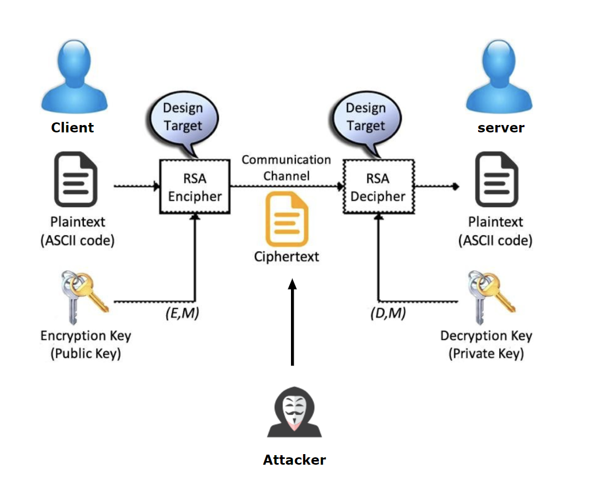

# RSA Vulnerability Demo

This project demonstrates vulnerabilities in RSA Encryption, including **Small Exponent Attack**, **Common Modulus Attack**, and **CRT Fault Attack**. It simulates these attacks in a Client-Server architecture and includes a graphical user interface (GUI) for the Client built with Tkinter.

## RSA Vulnerabilities Demonstrated


1. **Small Exponent Attack**: Exploits the use of a small exponent (e.g., `e = 3`) for faster decryption, allowing plaintext recovery from ciphertext.
2. **Common Modulus Attack**: Occurs when different systems use the same modulus `n` but with different public exponents, enabling attackers to potentially decrypt the message.
3. **CRT Fault Attack**: Takes advantage of faults during the computation of RSA signatures using the Chinese Remainder Theorem (CRT).

---

## Architecture Overview


### **Server**
- **Functionality:**
  - Generates RSA key pairs for secure communication.
  - Provides functionality for the Client to encrypt messages using a session key after an RSA key exchange.
  - Simulates vulnerabilities to demonstrate risks in RSA-based key exchanges:
    - **Small Exponent Attack**: Exploits a small public exponent, such as `e = 3`, to recover plaintext from ciphertext.
    - **Common Modulus Attack**: Reuses the same modulus `n` for multiple RSA key pairs with different public exponents to decrypt information.
    - **CRT Fault Attack**: Introduces a fault in the RSA signature generation process using the Chinese Remainder Theorem (CRT) to exploit weaknesses in the signing process.

### **Client**
- **Functionality:**
  - Implements a GUI using **Tkinter**.
  - Allows the user to:
    - Input a message, encrypt it using a session key (via RSA key exchange), and send it to the Server.
    - View the Server's response after decryption or processing.
    - Ensure the integrity of communication by validating the Server's public certificate.

### **Attacker (MITM)**
- **Functionality:**
  - Simulates **Man-in-the-Middle (MITM)** attacks on the RSA-based session key exchange process:
    - **Small Exponent Attack**: Recovers plaintext from ciphertext by exploiting a small public exponent (`e = 3`).
    - **Common Modulus Attack**: Exploits two ciphertexts encrypted with the same modulus `n` but different public exponents to decrypt the messages.
    - **CRT Fault Attack**: Exploits a fault in the RSA signature computation process using CRT to recover private keys or forge signatures.

---

### **Directory Structure**

```plaintext
rsa-vulnerability-demo/
├── server/
│   ├── app.py                # Flask Server: API and communication logic for Client and vulnerability simulations
│   ├── crypt_utils.py        # Cryptographic utilities (key generation, encryption, decryption, etc.)
│   ├── private_key.pem       # RSA private key used for decryption and signing
│   ├── server_cert.pem       # Server's public certificate for Client validation
│
├── client/
│   ├── client.py             # Tkinter-based Client GUI for encrypting and sending messages
│   ├── crypt_utils.py        # Cryptographic utilities (key exchange, encryption, decryption, etc.)
│   ├── server_cert.pem       # Server's public certificate for Client to verify the server's identity
│
├── attacker/
│   ├── rsa_small_exponent.py # Small Exponent Attack implementation for the attacker (MITM)
│   ├── rsa_common_modulus.py # Common Modulus Attack implementation for the attacker (MITM)
│   ├── rsa_crt_fault.py      # CRT Fault Attack implementation for the attacker (MITM)
├── requirements.txt          # Python dependencies
└── README.md                 # Documentation and project description
```
